# 📚 LMS Kampus Pintar

**LMS Modern — Kelompok Keliatan**

Sistem Manajemen Pembelajaran (*Learning Management System*) berbasis **Progressive Web App (PWA)** yang mendukung mode offline, sinkronisasi real-time, dan dua peran pengguna: **Mahasiswa** dan **Dosen**.


🔗 **Demo:** [juna1d1.github.io/pwa/LMS](https://juna1d1.github.io/pwa/LMS/index.html)

---

## 👥 Anggota Kelompok

| Nama | NIM |
|---|---|
| Junaidi | 202301110017 |
| M. Tanzil Kirami Hamdi | 202301110047 |
| Eiffen Arjen Ariyanto | 202301110037 |
| Renaldi Sentosa | 202301110010 |
| Nur Rabiatul Adawiyah | 202301110021 |
| Gizza Farah Nadifa | 202301110036 |

---

## 📖 Daftar Isi

- [Tentang Aplikasi](#-tentang-aplikasi)
- [Fitur Utama](#-fitur-utama)
- [Peran Pengguna](#-peran-pengguna)
- [Memulai Aplikasi](#-memulai-aplikasi)
- [Registrasi & Login](#-registrasi--login)
- [Panduan untuk Mahasiswa](#-panduan-untuk-mahasiswa)
- [Panduan untuk Dosen](#-panduan-untuk-dosen)
- [Navigasi Aplikasi](#-navigasi-aplikasi)
- [Tips & Troubleshooting](#-tips--troubleshooting)
- [Tech Stack](#-tech-stack)

---

## 📌 Tentang Aplikasi

**LMS Kampus Pintar** adalah platform pembelajaran digital (Learning Management System) berbasis Web yang dirancang untuk mendukung interaksi akademik modern antara Dosen dan Mahasiswa. LMS Kampus Pintar memungkinkan **Dosen** membuat dan membagikan materi pembelajaran beserta soal quiz, sementara **Mahasiswa** dapat mempelajari materi, mengerjakan quiz, dan mengunduh sertifikat kelulusan.

Sebagai Progressive Web App (PWA) modern, Aplikasi dapat diakses langsung lewat browser maupun dipasang (*install*) ke perangkat seperti aplikasi native, serta tetap dapat digunakan meski koneksi internet terputus — data disimpan secara lokal (IndexedDB) dan disinkronkan otomatis ke cloud (Firebase) begitu koneksi tersedia kembali.

## ✨ Fitur Utama

- 🔐 Autentikasi dua peran: **Mahasiswa** dan **Dosen (Admin)**
- 📝 Manajemen materi pembelajaran (tambah, edit, hapus, lampiran gambar/PDF)
- ❓ Bank soal quiz pilihan ganda per materi
- ✅ Pengerjaan quiz dengan penilaian otomatis dan syarat kelulusan
- 🏆 Sertifikat digital yang dapat diunduh sebagai gambar (PNG)
- 📊 Dashboard statistik dan grafik progres belajar/mengajar
- ☁️ Sinkronisasi data real-time ke cloud dengan dukungan mode offline

## 🎭 Peran Pengguna

| Fitur | Mahasiswa | Dosen (Admin) |
|---|:---:|:---:|
| Melihat materi | ✅ | ✅ *(materi sendiri)* |
| Menambah/mengubah materi | ❌ | ✅ |
| Membuat soal quiz | ❌ | ✅ |
| Mengerjakan quiz | ✅ | ❌ *(mode pratinjau)* |
| Mengunduh sertifikat | ✅ | ❌ |

---

## 🚀 Memulai Aplikasi

### Mengakses Aplikasi

Buka tautan berikut melalui browser (disarankan Google Chrome):

```
https://juna1d1.github.io/pwa/LMS/index.html
```

### Memasang Aplikasi sebagai PWA (Opsional)

1. Buka tautan aplikasi di browser Chrome (desktop atau Android).
2. Klik ikon **Install** pada address bar, atau menu titik tiga → **"Install App"** / **"Add to Home Screen"**.
3. Ikon aplikasi akan muncul di layar utama atau desktop perangkat.

> 💡 Pada iOS (Safari), gunakan tombol **Share → "Add to Home Screen"**.

### Mode Online dan Offline

Status koneksi ditampilkan di pojok kanan atas berupa lencana (*badge*):

- 🟢 **"Tersinkronisasi"** — perangkat terhubung ke internet, data tersinkron ke server.
- 🔴 **"Offline"** — perangkat tidak terhubung; data tetap tersimpan lokal dan otomatis tersinkron saat online kembali.

---

## 🔑 Registrasi & Login

### Membuat Akun Baru

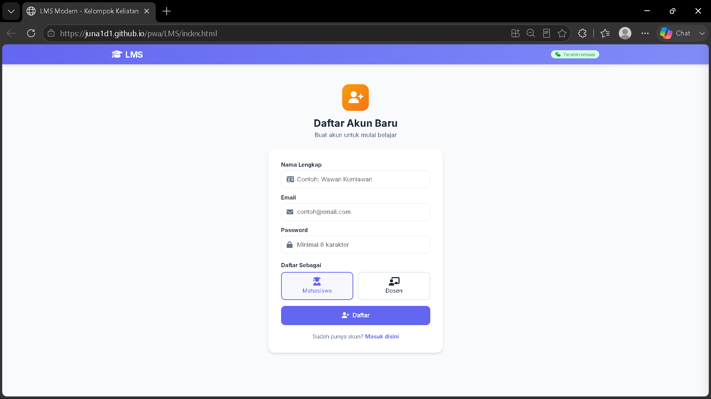

1. Pada halaman Masuk, klik tautan **"Daftar disini"**.
2. Isi Nama Lengkap, Email, dan Password (minimal 6 karakter).
3. Pilih peran pendaftaran: **Mahasiswa** atau **Dosen**.
4. Klik tombol **"Daftar"**.
5. Setelah berhasil, sistem akan mengarahkan kembali ke halaman Masuk.

> ⚠️ Setiap email hanya dapat digunakan untuk satu akun. Data akun disimpan secara lokal pada perangkat/browser yang digunakan saat mendaftar.

### Masuk ke Akun (Login)

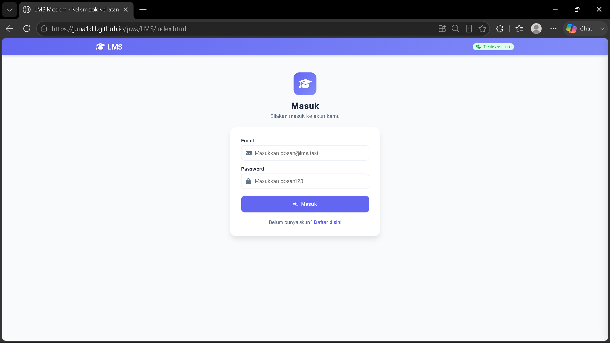

1. Isi Email dan Password yang telah didaftarkan.
2. Klik tombol **"Masuk"**.
3. Pengguna akan diarahkan ke halaman Dashboard sesuai perannya.

### Keluar (Logout)

Klik menu **"Keluar"** pada navigasi atas (desktop) atau menu **"Lainnya" → "Keluar"** (mobile).

---

## 🎓 Panduan untuk Mahasiswa

### Dashboard

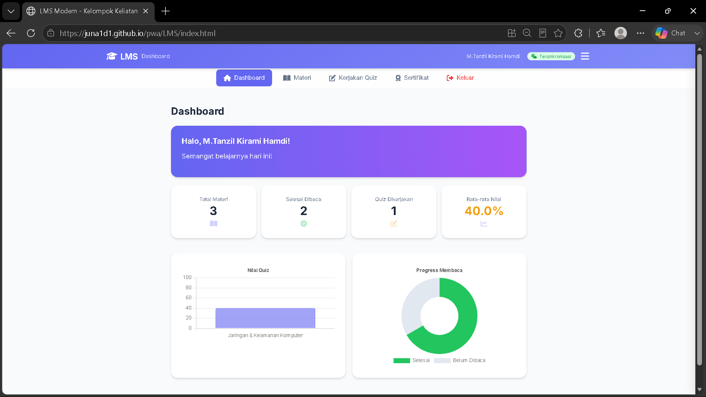

Menampilkan ringkasan aktivitas belajar:
- Total Materi yang tersedia
- Jumlah materi yang telah **Selesai Dibaca**
- Jumlah **Quiz** yang telah dikerjakan
- **Rata-rata Nilai** dari seluruh quiz
- Grafik batang nilai per quiz & grafik donat progres membaca

### Mempelajari Materi

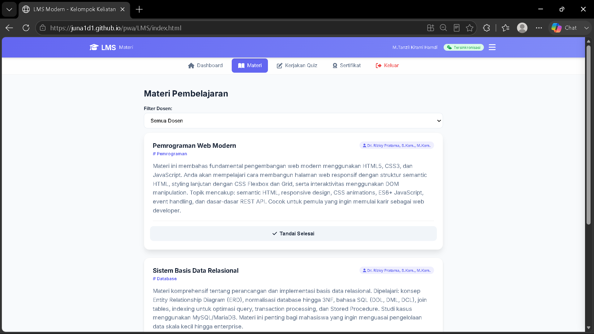

1. Buka menu **"Materi"**.
2. *(Opsional)* Gunakan **Filter Dosen** untuk menampilkan materi dari dosen tertentu.
3. Klik salah satu kartu materi untuk membaca detail lengkap beserta lampiran (gambar/PDF) jika ada.
4. Klik **"Tandai Selesai Dibaca"** agar materi tercatat selesai dan quiz terkait terbuka.

> 💡 Quiz suatu materi hanya dapat dikerjakan setelah materi tersebut ditandai selesai.

### Mengerjakan Quiz

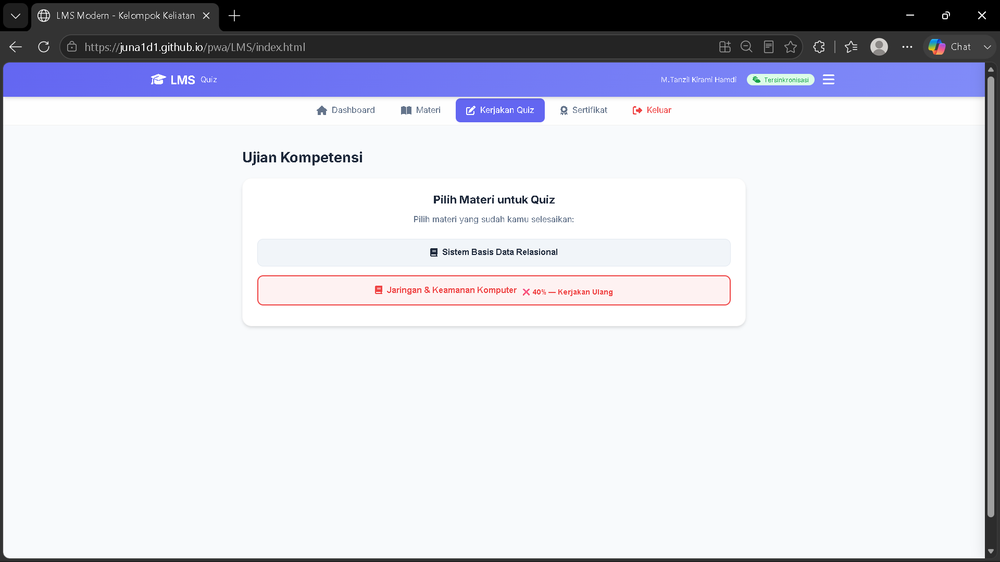
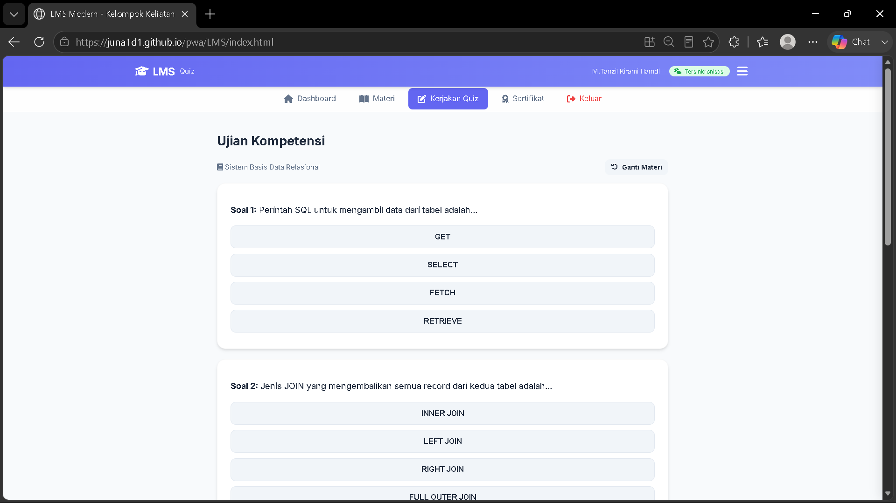

1. Buka menu **"Quiz"**.
2. Pilih salah satu materi yang berstatus selesai.
3. Jawab tiap soal pilihan ganda — jawaban benar/salah langsung ditampilkan.
4. Klik **"Selesaikan Ujian"** setelah semua soal dijawab.
5. Nilai akhir (dalam persen) ditampilkan.

**Ketentuan kelulusan:**
- Nilai **≥ 70%** → **Lulus**, sertifikat otomatis dapat diunduh.
- Nilai **< 70%** → dapat mengulang quiz pada materi yang sama.
- Materi yang sudah lulus tidak dapat dikerjakan ulang; hasil sebelumnya beserta kunci jawaban ditampilkan.

### Sertifikat

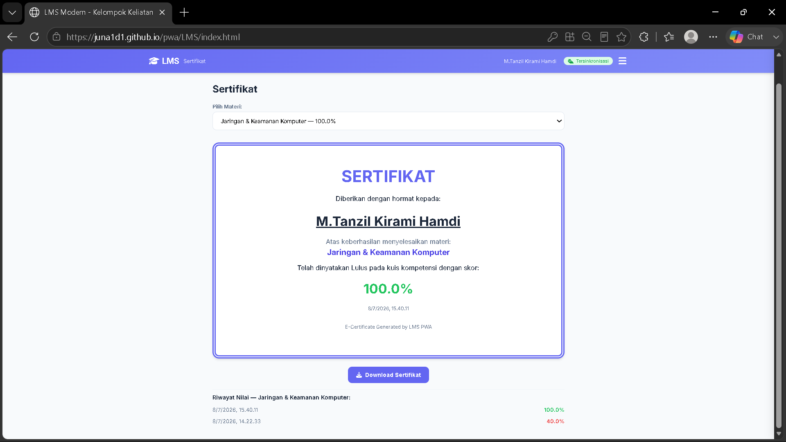

1. Buka menu **"Sertifikat"**.
2. Pilih materi yang ingin dilihat sertifikatnya melalui dropdown **"Pilih Materi"**.
3. Sertifikat digital (nama, judul materi, skor, tanggal) ditampilkan.
4. Klik **"Download Sertifikat"** untuk menyimpan sebagai gambar PNG.
5. Riwayat seluruh percobaan nilai ditampilkan di bagian bawah.

---

## 👨‍🏫 Panduan untuk Dosen

### Dashboard

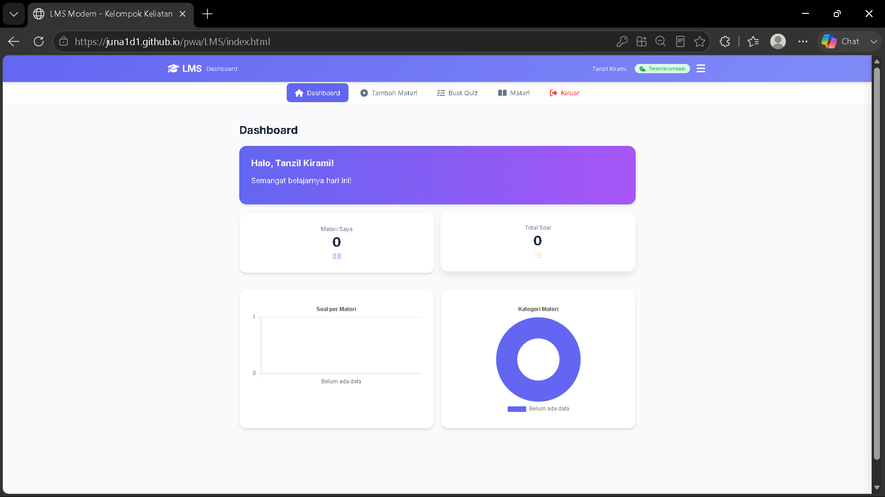

Menampilkan jumlah materi milik sendiri, total soal yang dibuat, grafik jumlah soal per materi, dan grafik distribusi kategori materi.

### Menambah Materi Pembelajaran

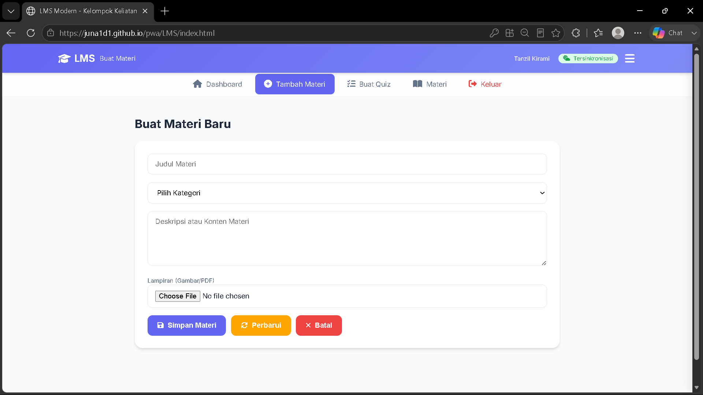

1. Buka menu **"Tambah Materi"**.
2. Isi Judul Materi, pilih Kategori (Pemrograman/Jaringan/Database), dan isi Deskripsi/Konten.
3. *(Opsional)* Unggah lampiran gambar atau PDF.
4. Klik **"Simpan Materi"**.

### Mengubah & Menghapus Materi

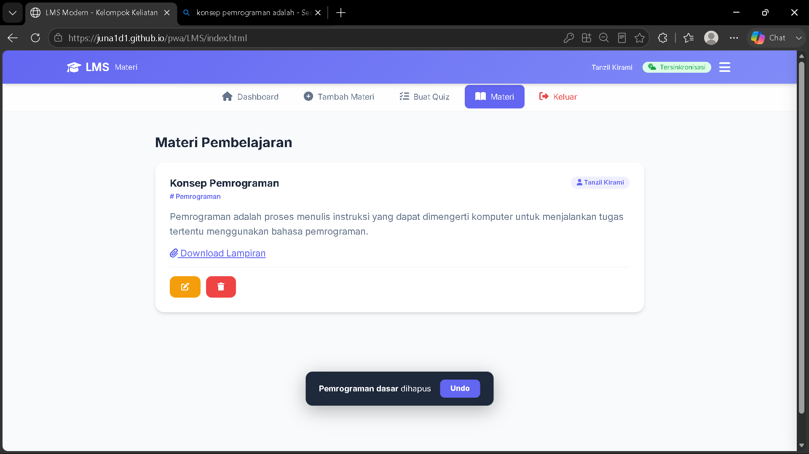

1. Buka menu **"Materi"** — hanya materi milik sendiri yang menampilkan tombol aksi.
2. Klik ikon ✏️ (Edit) untuk memperbarui, lalu klik **"Perbarui"**.
3. Klik ikon 🗑️ (Hapus) untuk menghapus. Notifikasi **"Undo"** muncul selama 5 detik untuk membatalkan.

### Membuat Soal Quiz

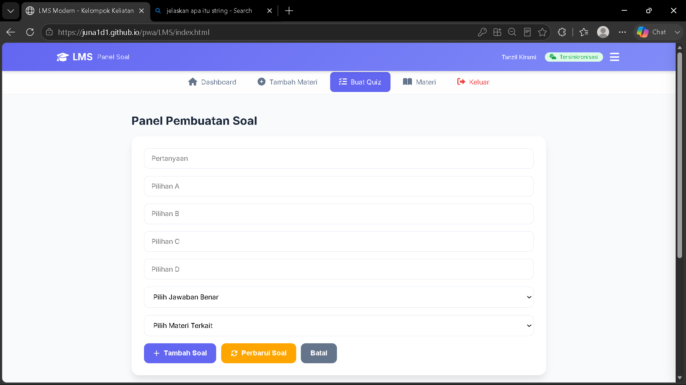

1. Buka menu **"Buat Quiz"**.
2. Isi Pertanyaan dan keempat pilihan jawaban (A–D).
3. Pilih jawaban benar pada dropdown **"Pilih Jawaban Benar"**.
4. Pilih **Materi Terkait** agar soal terhubung dengan materi yang sesuai.
5. Klik **"Tambah Soal"**.

### Mengubah & Menghapus Soal

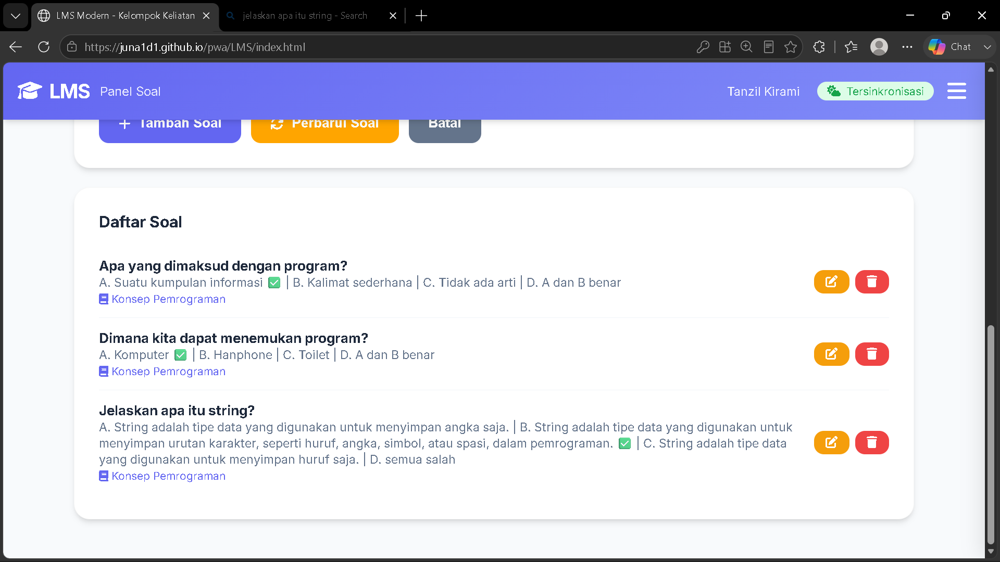

1. Pada daftar soal, klik ikon ✏️ untuk mengedit, lalu klik **"Perbarui Soal"**.
2. Klik ikon 🗑️ untuk menghapus soal (diminta konfirmasi).

> 💡 Dosen hanya dapat melihat, mengubah, dan menghapus materi serta soal miliknya sendiri.

---

## 🧭 Navigasi Aplikasi

**Desktop** — Menu navigasi horizontal di bawah header: Dashboard, Tambah Materi & Buat Quiz *(khusus Dosen)*, Materi, Kerjakan Quiz & Sertifikat *(khusus Mahasiswa)*, serta tombol Keluar.

**Mobile** — Dua bentuk navigasi:
- **Bottom Navigation Bar** — akses cepat ke Beranda, Materi, Quiz, Sertifikat.
- **Menu "Lainnya"** (ikon ☰ di header) — membuka panel *drawer* berisi seluruh menu sesuai peran.

---

## 🛠️ Tips & Troubleshooting

| Masalah | Solusi |
|---|---|
| Lupa password | Belum ada fitur reset otomatis — daftar ulang dengan email berbeda. |
| Materi/soal tidak muncul | Pastikan status sinkronisasi "Tersinkronisasi"; jika "Offline", tunggu koneksi kembali. |
| Data hilang setelah ganti perangkat/browser | Akun tersimpan lokal di perangkat/browser tempat registrasi — gunakan yang sama, atau daftar ulang. |
| Nilai quiz tidak mencapai 70% | Pelajari ulang materi, lalu klik "Coba Lagi" saat hasil quiz ditampilkan. |
| Sertifikat tidak muncul | Sertifikat hanya tersedia untuk materi dengan nilai quiz ≥ 70%. |

---

## 🧩 Tech Stack

- **Frontend:** HTML5, CSS3, Vanilla JavaScript
- **Penyimpanan lokal:** IndexedDB (offline-first)
- **Sinkronisasi cloud:** Firebase Firestore
- **PWA:** Service Worker + Web App Manifest
- **Visualisasi data:** Chart.js
- **Ekspor sertifikat:** html2canvas
- **Hosting:** GitHub Pages

---

<p align="center">Dibuat oleh <b>Kelompok Keliatan</b> — Tugas Wireless and Mobile Computing</p>
